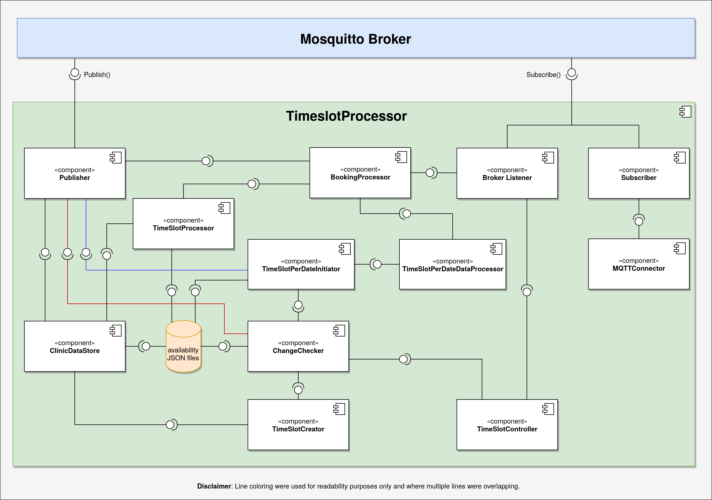

# Availability

## Link to main documentation repository

- [Documentation repository](https://github.com/krasen86/documentation)

## Project setup

### Prerequisites

- Install the dependency packages from npm
``` 
npm install
```

### Run the service
```
cd src
node index.js
```

## Diagrams

### Low-level timeSlotProcessor component diagram

